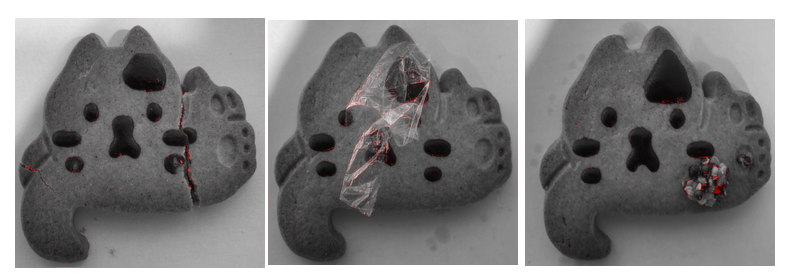

# Unsupervised-Anomaly-Detection-Pytorch
Use unsupervised learning for anomaly detection.

In an industrial setting (factories etc), it is usually easy to collect a lot of samples without defect. However anomalies can be very diverse in appearance, type and very rare which make it very difficult to collect and annonate enough data. Unsupervised learning is very useful in such cases.

The model task is to reconstruct the image given as input. Since it has only been trained on "normal" samples, reconstruction on anomalies parts should be poor. By taking difference of the reconstruction output and input, we may be able to detect the anomaly.

## Toy dataset
We created a tiny toy dataset of 31 images. (24 normal samples and 7 anomaly samples).

Anomalies for testing include
- Broken cookie
- Mustard on wookie
- Plastic wrap on cookie

Below are samples of the dataset :

## Example of outputs
Below are examples of outputs from the test set.

## To do list
- [x] Add Unet
- [ ] Add VAE
- [ ] Add Normalizing flow (Less able to generate new content)
- [ ] Improve reproducibility (copyfile config, save datasplit)

## Ressources used 
- https://github.com/usuyama/pytorch-unet for UNET architecture
