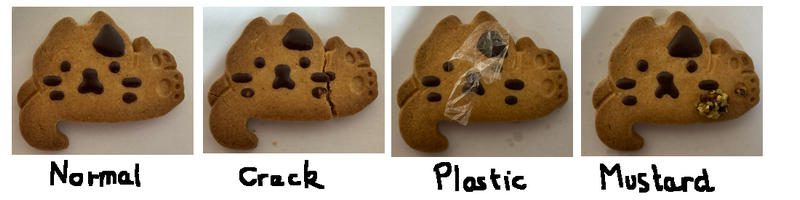

# Unsupervised-Anomaly-Detection-Pytorch

In an industrial setting (factories etc), it is usually easy to collect a lot of samples without defect. However anomalies can be very diverse in appearance, type and very rare which make it very difficult to collect and annonate enough data. Unsupervised learning is very useful in such cases.

We proposed two methods for anomaly detection.

- Auto-encoder : The model task is to reconstruct the image given as input. Since it has only been trained on "normal" samples, reconstruction on anomalies parts should be poor. By taking difference of the reconstruction output and input, we may be able to detect the anomaly.

- Clustering : We train a Kmeans to find clusters on normal train samples. When computing the distance between test samples to cluster, we assume the distance will be big if the sample is an anomaly

## Toy dataset
We created a tiny toy dataset of 31 images. (24 normal samples and 7 anomaly samples).

Anomalies for testing include
- Broken cookie
- Mustard on cookie
- Plastic wrap on cookie

Below are samples of the dataset :



Note. This task is suprisingly not as easy as it looks as those cookies are made by hand and aren't perfectly identical (chocolate position, small chocolate smear, cookie texture, natural tiny cracks that aren't anomalies etc.)

## How to run

Install requirements
```
pip install -r requirements.txt 
```

Train a model
```
python3 train.py
```

Clustering (Kmeans)
```
python3 kmeans.py
```

## Example of outputs
### AE
Below are examples of outputs from the test set.
Red parts are the differences betwen AE reconstruction and input (assumed to be anomaly).


### Kmeans
Normal samples
```
3_2,0.009958153114972931
3_3,0.009679524190185567
4_1,0.013349829967023143
4_2,0.01383117944420742
...
```

Anomaly samples
```
crack,0.02646307087752998
mustard,0.02195608640461167
plastic,0.02594535769253819
```

With a threshold of 0.02, we can differentiate normal to anomaly samples.

## To do list
- [x] Add Unet
- [x] Add Kmeans
- [ ] Add VAE
- [ ] Add Normalizing flow (Less able to generate new content)
- [ ] Improve reproducibility (copyfile config, save datasplit)

## Ressources used 
- https://github.com/usuyama/pytorch-unet for UNET architecture
